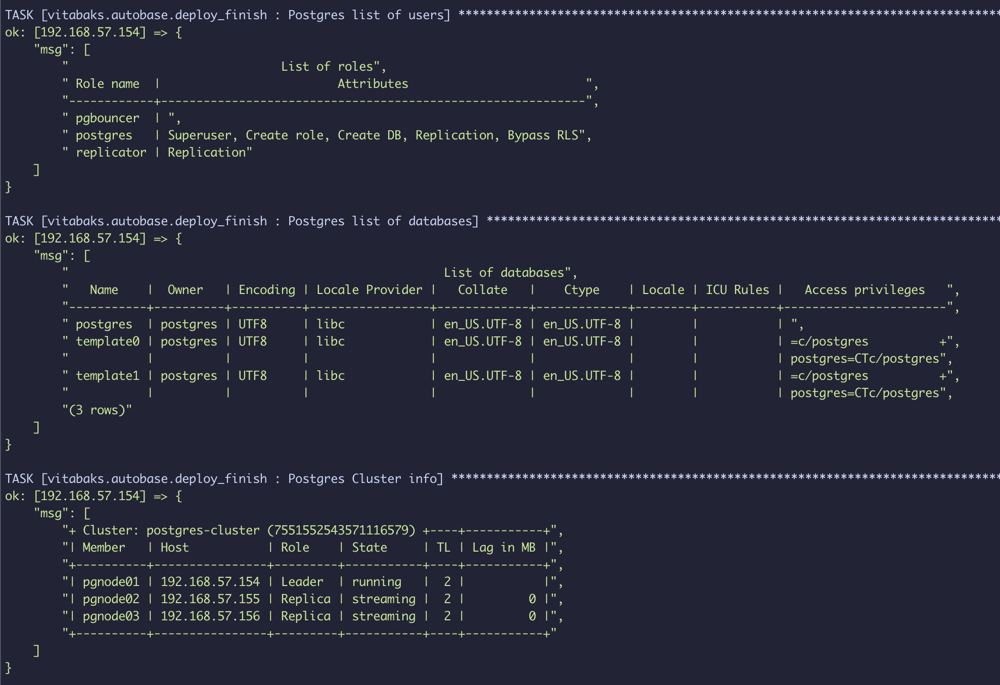

## Requirements
- virtualbox
- vagrant

## Setup
create private subnet:  
- name: `db-subnet`  
- mask: `255.255.255.0`
- cidr: `192.168.58.0/24`

run:
```bash
./provision.sh
```

Check Cluster health:
```bash
patronictl -c /etc/patroni/patroni.yml list
```
